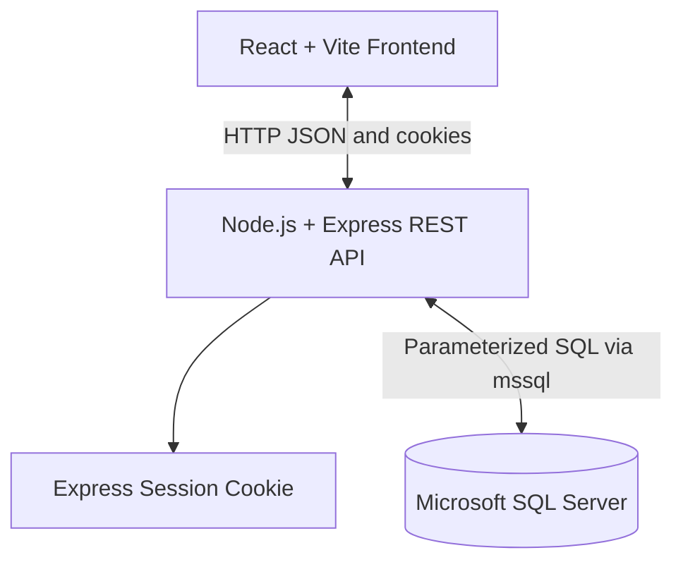

# Technical Event Management System - Project Report

## 1. Project Overview

The Technical Event Management System is a full-stack college tech-fest portal for participants, organizers, and judges. It supports intra-college, inter-college, and zonal technical events. Participants can create accounts, browse events, register, download QR tickets, and manage their registrations. Organizers can manage events, monitor participants, assign judges, and review dashboard analytics.

The application is organized as a React/Vite frontend, an Express REST API, and a Microsoft SQL Server database. Authentication uses bcrypt password hashing and server-side sessions.

## 2. Technology Stack

### Frontend

- React 19
- Vite 7
- React Router DOM 7
- Axios
- Vanilla CSS with shared theme tokens and responsive layouts
- Tailwind CSS/PostCSS tooling present in the frontend package
- Lucide React icons
- `react-hot-toast` for action-level notifications
- `react-datepicker` for themed date/time inputs
- `qrcode.react` for downloadable registration tickets
- ESLint with React hooks and refresh plugins

### Backend

- Node.js using ES modules
- Express 5
- `mssql` for SQL Server access
- `express-session` for cookie-based server sessions
- `bcrypt` for password hashing
- `cors`, `body-parser`, and `dotenv`

The project uses SQL Server and does not use MySQL or `mysql2`.

## 3. System Architecture

The system follows a three-tier architecture:



The frontend runs by default at `http://localhost:5173` and uses `VITE_API_URL` to call the backend at `http://localhost:5000`. Protected API routes use the authenticated session cookie and role-specific middleware.

## 4. Database Design

The current master schema is [`backend/schema.sql`](backend/schema.sql). It recreates the tables in dependency order and uses `EventManagement` as the database name.

### Tables

1. **`users`** - Participant accounts, contact information, college, and creation timestamp.
2. **`organizer`** - Organizer accounts, department, and creation timestamp.
3. **`events`** - Event name, description, date, time, location, scope, capacity, and registration deadline.
4. **`sponsor`** - Sponsor directory and contribution details.
5. **`judge`** - Organizer-managed judge directory associated with events.
6. **`event_organizer`** - Many-to-many event/organizer junction table with a unique event-organizer constraint.
7. **`event_sponsor`** - Many-to-many event/sponsor junction table with a unique event-sponsor constraint.
8. **`registrations`** - Participant/event registrations with foreign keys, participant snapshot fields, timestamps, and `UNIQUE (user_id, event_id)`.
9. **`results`** - Event results with position, score, remarks, and a unique event/user constraint.

`event_scope` is restricted to `intra-college`, `inter-college`, or `zonal`. Registration counts are derived from the `registrations` table rather than stored as mutable counters. User-facing seat displays use `registered_count / capacity`; `seats_left` remains available for sold-out detection.

## 5. Authentication and Authorization

- Participant signup and login are handled through the participant authentication flow.
- Organizers use a separate login page and role-specific session.
- Organizer account creation is intentionally manual: a bcrypt hash is generated locally and inserted through SSMS.
- Session cookies are HTTP-only for local development.
- Role-gated navigation and routes separate participant and organizer experiences.
- Organizer event and judge operations require organizer authorization.
- Registration cancellation is ownership-scoped to the authenticated participant.

## 6. Implemented Features

### Participant Portal

- Landing page and participant authentication
- Browse Events page with search and event-scope filters
- Event states for Register, Registered, and Sold Out
- Capacity and registration-deadline handling
- Duplicate-registration protection
- Participant dashboard with registration statistics and event details
- Registration cancellation with confirmation modal
- QR ticket/pass generation and download containing the registration ID
- Empty-state guidance when the participant has no registrations
- Toast feedback for signup, login, registration, cancellation, and logout actions

### Organizer Portal

- Organizer authentication and role-gated dashboard
- Dashboard analytics and Event Overview
- Event creation, editing, and deletion
- Event search and participant search
- Participant table with ten-row pagination and range labels
- Filtered participant CSV export
- Judge assignment, editing, and deletion
- Confirmation modals for event deletion and judge removal
- Consistent `registered_count / capacity` display across organizer event views

### Shared UI Foundation

- Shared `PageLayout` with centered max-width content and responsive horizontal padding
- Consistent page-header bands and card surfaces
- Participant and organizer navigation components
- Shared footer
- Global `react-hot-toast` provider and toast helper functions
- Reusable `ConfirmModal`
- Theme tokens for surfaces, text, borders, accent, success, and error states
- Themed date/time picker wrapper
- Inline validation for capacity, deadlines, phone values, and judge fields

## 7. API Surface

The backend is divided into route modules:

- `auth.js` - participant login and session handling
- `signup.js` - participant account creation
- `register.js` - participant event registration and cancellation
- `participant.js` - participant dashboard data
- `organizer.js` - organizer login, event data, event CRUD, participant data, and judge management

Representative operations include:

- `POST /api/signup`
- `POST /api/login`
- `POST /api/organizer/login`
- `GET /api/organizer/events`
- `GET /api/organizer/my-events`
- Organizer event create/update/delete endpoints
- Participant registration and cancellation endpoints
- Organizer registration and judge-management endpoints

Event endpoints expose both a true grouped `registered_count` and a separately calculated `seats_left`. The frontend uses `seats_left` only to disable registration when an event is full.

## 8. Project Structure

```text
Technical-Event-Management/
├── .env
├── README.md
├── PROJECT_REPORT.md
├── backend/
│   ├── .env.example
│   ├── db.js
│   ├── migrate-judge-assignment.js
│   ├── package.json
│   ├── schema.sql
│   ├── seed_organizer.sql
│   ├── server.js
│   ├── middleware/
│   │   ├── authMiddleware.js
│   │   └── organizerAuth.js
│   └── routes/
│       ├── auth.js
│       ├── organizer.js
│       ├── participant.js
│       ├── register.js
│       └── signup.js
└── frontend/
    └── myapp/
        ├── .env
        ├── index.html
        ├── package.json
        ├── vite.config.js
        └── src/
            ├── App.jsx
            ├── index.css
            ├── main.jsx
            ├── theme.css
            ├── components/
            │   ├── ConfirmModal.jsx
            │   ├── Footer.jsx
            │   ├── LoginForm.css
            │   ├── LoginForm.jsx
            │   ├── Navbar.css
            │   ├── Navbar.jsx
            │   ├── OrganizerNavbar.css
            │   ├── OrganizerNavbar.jsx
            │   ├── PageLayout.jsx
            │   ├── ParticipantNavbar.css
            │   ├── ParticipantNavbar.jsx
            │   ├── Sidebar.css
            │   ├── Sidebar.jsx
            │   ├── ThemedDatePicker.css
            │   ├── ThemedDatePicker.jsx
            │   ├── ToastProvider.jsx
            │   └── shared.css
            ├── context/
            │   └── AuthContext.jsx
            ├── pages/
            │   ├── Contact.css
            │   ├── Contact.jsx
            │   ├── Events.css
            │   ├── Events.jsx
            │   ├── Login.css
            │   ├── Login.jsx
            │   ├── OrganizerAuth.jsx
            │   ├── OrganizerDashboard.css
            │   ├── OrganizerDashboard.jsx
            │   ├── ParticipantAuth.css
            │   ├── ParticipantAuth.jsx
            │   ├── ParticipantDashboard.css
            │   ├── ParticipantDashboard.jsx
            │   ├── Pregister.jsx
            │   └── pregister.css
            └── utils/
                ├── api.js
                ├── toast.js
                └── useToast.js
```

`Pregister.jsx` is the current authenticated participant registration page. The former `Register.jsx` and `Register.css` files are not present in the current project.

## 9. Setup and Operation

1. Enable SQL Server mixed-mode authentication and restart the SQL Server service.
2. Create the `EventManagement` database and a SQL login/user.
3. Run `backend/schema.sql` in SSMS.
4. Create the project-root `.env` using `backend/.env.example`.
5. Create `frontend/myapp/.env` with `VITE_API_URL=http://localhost:5000`.
6. Install and start the backend:

   ```bash
   cd backend
   npm install
   npm start
   ```

7. Install and start the frontend in a second terminal:

   ```bash
   cd frontend/myapp
   npm install
   npm run dev
   ```

Backend scripts are `npm start`, `npm run dev`, and the placeholder `npm test`. Frontend scripts are `npm run dev`, `npm run build`, `npm run lint`, and `npm run preview`.

## 10. Known Limitations

- The backend development script runs plain Node and does not watch or restart automatically.
- No automated backend test suite is configured; `npm test` remains a placeholder.
- Organizer creation is manual and has no self-service signup screen.
- Local cookies use development HTTP settings; production requires HTTPS and hardened production configuration.
- Sponsor and results tables exist in the schema, but complete sponsor/results management workflows are not exposed in the current UI.
- The application requires a reachable SQL Server configured with the expected environment variables.
